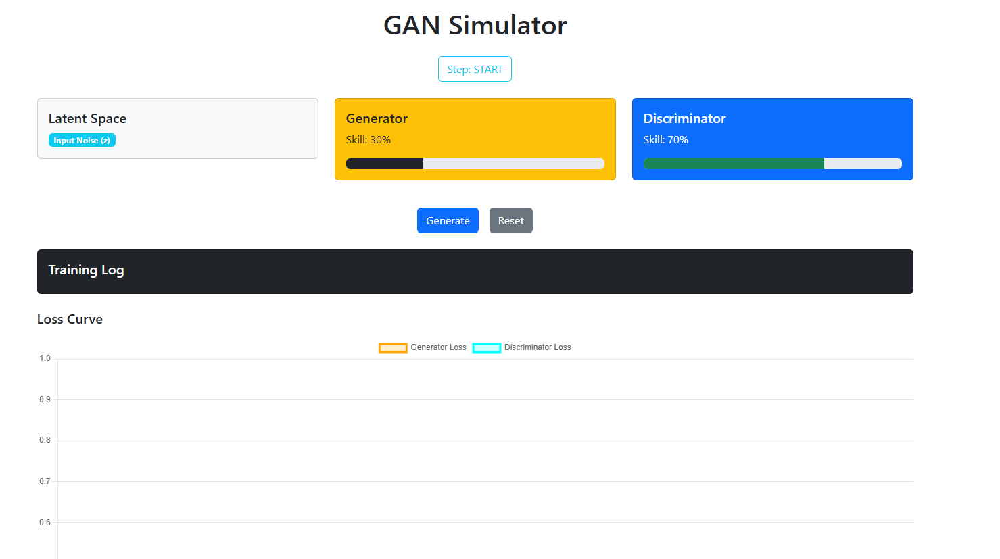

# GAN Interactive Simulator

**Author**: Abdulrahman Hamdi – AI Engineer\
**Repository**: [github.com/abdulrahmanhamdi/GAN-Simulation-Game](https://github.com/abdulrahmanhamdi/GAN-Simulation-Game))

---

## Overview

The **GAN Interactive Simulator** is a responsive and modular educational web application that visualizes the inner working of a Generative Adversarial Network (GAN). It provides a practical demonstration of how the Generator and Discriminator interact and improve over time using live updates and visual feedback.

This tool is ideal for instructors, students, and researchers who want to understand GANs through direct simulation, without requiring deep background in neural network code.

---

> 
> **Figure 1:** Preview
---

## Features

- Dynamic noise injection from latent space (z)
- Generator and Discriminator units with adjustable skill levels
- Real-time skill tracking using Bootstrap progress components
- Interactive training log and loss curve
- Step-by-step guided explanation of the GAN learning process
- Chart.js integration to visualize generator and discriminator loss
- Built with clean Bootstrap-based UI and scalable layout

---

## Live Preview

You can host it locally or deploy to platforms like **Vercel**, **Netlify**, or **GitHub Pages**.\
To host locally, follow the steps below.

---

## Installation

### Prerequisites

- Node.js (v18+ recommended)
- npm

### Steps

```bash
git clone https://github.com/abdulrahmanhamdi/GAN-Simulation-Game.git
cd gan-simulator
npm install
npm run dev
```

Then open your browser at:\
`http://localhost:5173`

---

## File Structure

```
src/
├── components/
│   └── GANSimulator.jsx      # Main simulator component
├── App.jsx                   # Application entry point
├── main.jsx                  # Vite entry file
├── index.css                 # Optional global styles
```

---

## Technology Stack

| Tool            | Purpose                            |
| --------------- | ---------------------------------- |
| React           | UI and State Management            |
| Bootstrap 5     | Styling and layout components      |
| Chart.js        | Visualize loss values over time    |
| Vite            | Build tool for fast dev experience |
| React-Chartjs-2 | React wrapper for Chart.js         |

---

## Learning Process Explained

Each simulation cycle includes the following steps:

1. **Latent Space (Noise)**\
   A random noise vector `z` is sampled as input for the generator.

2. **Generator Phase**\
   The generator transforms the noise into fake data `x'` using its learned weights.

3. **Discriminator Evaluation**\
   The discriminator evaluates both real and fake samples to classify them.

4. **Training Update**\
   Based on the discriminator's decision, either G or D improves its skill score.

5. **Loss Visualization**\
   Generator and Discriminator losses are tracked and plotted over time to observe learning behavior.

---

## Planned Enhancements

- Add quiz-based training mode for students
- Instructor vs. Student view toggle
- Export training results to CSV or PDF
- Image generation mode (e.g., digit generation preview)
- Improved animations using Bootstrap Icons and motion CSS

---

## License

This project is licensed under the MIT License.\
Feel free to fork and use for educational or research purposes.

---

## Contact

For feedback or collaboration:\
GitHub Profile → [abdulrahmanhamdi](https://github.com/abdulrahmanhamdi)
